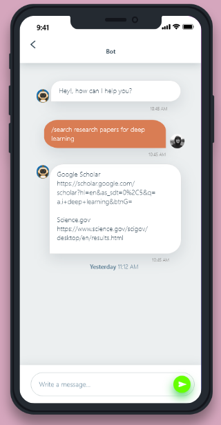
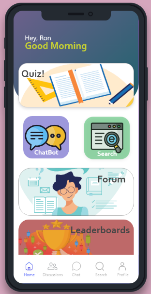

<h1 align="center">🎓 Learn-Up | Java Learning Chatbot</h1>
<p align="center">
  <i>An interactive mobile chatbot to help beginners learn Java basics — built for my thesis.</i>
</p>


---

## 📱 Project Overview

**Learn-Up** is an AI-powered mobile chatbot application created as my **thesis project**. Its goal is to provide an engaging and accessible way for beginners to learn **Java programming** using interactive conversations. Built with **React Native**, it delivers a smooth, cross-platform learning experience directly from your phone.

> 💬 Think Duolingo — but for Java.

---

## 💡 Why I Built This

As part of my academic journey and software development growth, I wanted to explore how AI and education can intersect in a mobile-first world. Learn-Up reflects my passion for:

- 📚 Making technical education fun and friendly
- 📱 Mobile-first UI/UX
- 🧠 Simplifying complex topics with AI

---

## 🛠️ Tech Stack

| Technology   | Purpose                         |
| ------------ | ------------------------------- |
| React Native | Cross-platform mobile app       |
| JavaScript   | App logic & chatbot behavior    |
| Custom AI    | Java lesson flow + interaction  |

---

## 📸 Screenshots 

 |  
---

## 🚀 Getting Started

```bash
# 1. Clone the repo
git clone https://github.com/ImPewPew/learn-up.git
cd learn-up

# 2. Install dependencies
npm install

# 3. Run the app
npx react-native run-android
# or
npx react-native run-ios
```
---
##  🚀 Project Structure

```bash
learn-up/
├── android/                 # Native Android config
├── ios/                     # Native iOS config
├── assets/                 # App images & media
├── components/             # UI components (ChatBubble, etc.)
├── screens/                # App screens (Chat, Lessons)
├── data/                   # Java lesson data & scripts
├── utils/                  # Chatbot logic & helpers
├── App.js                  # Entry point
└── package.json            # Dependencies & scripts
```

---
## 🎯 Features
🤖 AI Chatbot Interface – Talk to the bot like a tutor

📘 Structured Java Lessons – Learn step-by-step

📱 Mobile-Optimized – Built for Android & iOS

🧠 Designed for Beginners – No coding background needed

---
## 🧠 Lessons Covered

Variables & Data Types

Conditional Statements

Loops

---
## 🙏 Special Thanks

My thesis advisor & mentors

React Native and open-source communities

